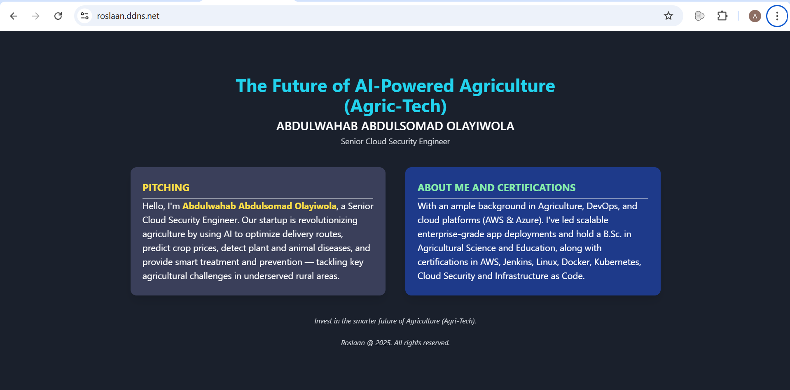

# Altschool Second Semester Examination Project

- NAME: Abdulwahab Abdulsomad Olayiwola
- SCHOOL ID: ALT/SOE/024/4646
- TRACK: Cloud Engineering
- SCHOOL: AltSchool Africa
- BATCH: Tinyuka '24

---

## Below is my submission/documentation for my Altschool Second Semester Examination Project

## PROJECT OVERVIEW

## The exam entails creating, deploying and configuring HTTPS for a dynamic web application as stated below

- Provisioning a server (Done with AWS Elastic Compute Cloud(EC2))
- Web Server Setup (Done with Nginx (A lightweight Webserver))
- Dynamic Landing Page (Beyond Static HTML) (Done with HTML, Tailwind css for styling and CSS for animations)
- Networking & Security (Production-Ready) (Done by allowing port 80 for HTTP and securing the Let's Encrypt (Certbot))

---

## PROJECT OBJECTIVES

The goal of this project is to provision/create a server, set up a web server, deploy a dynamic landing page and necessary networking settings to make the page publicly accessible. As a cloud engineer, I implored creative ways to do this examination by making use of automation which has tends to reduce manual and much work in tech ecosystem, so therefore using bash scripting makes the project faster for me and less cubersome documentation on the project.


Here is a step by step guide on how I completed the project.

## Phase 1: Compulsory Task

### Step 1: Creating my dynamic landing page

 1. I created my landing page and tested it in my local environment before pushing to Github and making it production ready.

I created four files

- __index.html__: To serve my webpage content, an embedded tailwind for styling the webpage and an inline javascript for changing the color of the webpage when it is being refreshed.

- __style.css__: My CSS codes that contains the styling and animations of the webpage.

- __app.js__:A Node.js application that serves web content and acts as the backend server that Nginx (configured as a reverse-proxy) forwards requests to.

- __automated-deployment.sh__ : A bash script code that automated the update and upgrade of the ec2 server, installation of nginx, cloning the code from GitHub, deploying and hosting of the web server, installation of nodejs and npm and installation of  certbot which is used for securing the web app with HTTPS.

> All of these files was pushed to github where the it will be cloned in the EC2 instance later on, the script was also pushed as reference but it will be used during the creation of the instance.

---

### Step 2: Provisioning/Creating a server with AWS EC2

1. Choosing a cloud provider:

    - I chose AWS as my cloud provider

2. Having an account with AWS already, I logged in to my console, search for EC2 in the search bar in the console then click on "launch instances" then I followed these steps:

- Name and Tags
    - __Name__ : Altsch-sec-semester-exam

- Application and OS Images (Amazon Machine Image)
    - __AMI__: Ubuntu Server 24.04 LTS (HVM), SSD Volume Type

- Instance Type
    - __instance type__ : t2.micro


- Key Pair (login)
    - I created a new key pair with the name (altschool) which will be use to ssh into my ec2 instance later on
        - __Key pair name__: altschool.pem

- Network Settings
    - __VPC__: Default VPC
    - __Subnet__: Default Subnet in any availability zone
    - __Auto-assign public IP__: Enable
    - Firewall (security groups)
        - I created a new security then;
            - I allow http which is on port 80 from any ip address on the internet
            - I allow https which is on port 443 from any ip address on the internet
            - I also allow ssh traffic from only my PC address for security wiseness
            -

- Under the advanced details section, there is a section called User Data, (picture shown below), it a field where you can upload your scripts to run at boot time (during the creation of the instance), and that is where I added my automated-deployment.sh file where it does the following steps by steps in the background as it is creating the instance:

```bash
# Update and install necessary packages in the server
apt update && upgrade -y
# Install Nginx (the webserver that will serve my webpage, and as the reverse proxy)
apt install nginx -y
# Clone my repository (index.html, style.css and app.js) from github
git clone https://github.com/Roslaan001/altsch-sec-semester-exam
# Move the cloned repository to the nginx web server default webpage directory
mv altsch-sec-semester-exam/* /var/www/html
# Remove the empty cloned repository directory since it is now empty
rm -rf altsch-sec-semester-exam
# Install Node.js and npm which is used for running nodejs
curl -sL https://deb.nodesource.com/setup_16.x | bash -
# Install nodejs
apt install nodejs -y
# Install npm packages
npm install
# Install Certbot for SSL           
apt install certbot python3-certbot-nginx -y
```
So basically, what this script will do is update the ec2, download nginx, clone my code from github, move it to the nginx default html path, download and install nodejs, and installing certbot which will be used for SSL certificate

After this, I clicked on launch instance to create my EC2 instance and it was created successfully

> The script was written to reduce the work of running the commands manually and one by one after creating the instance, the script xcan either be used as user data or run after creating the instance, in my case here, i am passing it as user data. As soon as the instance is created, check all what you install with the script

---

### Step 3. Networking Configuration

**Steps:**

1. **Allow HTTP Traffic:**
   - I ensured the security group allows inbound traffic on port 80 (HTTP) and port 443 (HTTPS).
   - I also ensured the security group allows inbound SSH traffic on port 22 (SSH)

2. **Access the Web Page:**
   - I access the public IP address (13.219.103.15) from any browser and it is displaying my dynamic webpage as shown in the image below

   
---

## Phase 2 : Bonus Task (Optional)

### Step 4: Getting a subdomain from no-ip for configuration of HTTPS

__no-ip.com__ [no-ip](https://www.noip.com/) is where I got my subdomain, No-IP is a service that provides Dynamic DNS (DDNS) and Managed DNS hosting. It allows users to map a fixed hostname to a dynamically changing IP address, enabling remote access to devices and services. No-IP's services also include Managed DNS, which provides reliable and redundant DNS hosting for websites. On getting to the website, I signed up with my google account, create a hostname (subdomain), input my EC2 IP address, chose a record and generated the hostname with DDNS key then waited a bit for no-ip to match my fixed subdomain name to the EC2 IP address, I got a subdomain with the name **roslaan.ddns.net** as shown in the image below


---

## Step 5: Bonus Task (optional) Securing the webpage with HTTPS using SSL Certificate

Configuring a website with HTTPS is very important because:

- it secures your website from hacker,
- it enhances security and data integrity,
- it improves Search Engine Optimization (SEO)
- it increases user trust and credibility
- it is among the requirements for compliance and regulatory

After the steps above, the next is sshing into my ec2 server, I did ssh using my wsl and the key pair I downloaded with the command

``` bash
ssh -i altschool.pem ubuntu@13.219.103.15
```

> An SSL certificate is a digital certificate that authenticates a website's identity and encrypts communication between a browser and the server, ensuring a secure connection. This encrypted connection, often indicated by an "HTTPS" address and a padlock icon in the browser, protects sensitive information like usernames, passwords, and credit card details from being intercepted.


I checked whether the SSL certificate tool (certbot) I will use configuring HTTPS which is certbot has been installed with scripts I used at the start of the instance with the command __certbot --version__ and I noticed it is installed, so I ran

``` bash
sudo certbot --nginx # This is used to obtain and install a free SSL/TLS certificate from Let’s Encrypt for my website running on Nginx. 
``` 
And it generated some prompts:

- Prompted me to input my email address which I did
- Asked whether I have read the terms and agreement which I input y for yes
- Asked whether I want to subscribe for newsletter which I input y for yes
- Then prompt me to enter my domain name that I want to secure so I input __roslaan.ddns.net__ and after some seconds, I got a successful message that my certificate has been deployed successfully

And that was how I secured my website with HTTPS

---

## Step 6: Bonus Task (optional) Adding reverse proxy with nodejs as the backend app and nginx as the reverse proxy

What is a reverse proxy?
A reverse proxy is a type of proxy server that acts on behalf of backend servers, specifically web servers, to handle client requests. It intercepts client requests, processes them, and then forwards them to the appropriate server, which can be different than the original server. The reverse proxy then sends the server's response back to the client. 

So in this case, I use nginx as the reverse proxy, the intermediary between the client(A user/browser) and the backend server (nodejs)

I configured the nginx config file which is __/etc/nginx/sites-available/default__ and added the reverse proxy parameters which are:

 ``` bash
proxy_pass http://localhost:3000;
proxy_http_version 1.1;
proxy_set_header Upgrade $http_upgrade;
proxy_set_header Connection 'upgrade';
proxy_set_header Host $host;
proxy_cache_bypass $http_upgrade;

```

This ensures that my web app runs on localhost at port 3000. It means that when a user sends a request, Nginx forwards it to my EC2 instance as localhost, and responds to the user without exposing the backend server's IP address.

So after this, I run __node app.js__ and my web page is up and running however there is a minor problem and it is that once I leave the terminal, the webpage stops working, so I had to either use nohup or systemD to make sure it is running after closing the terminal, I used, so I created a file named myapp.service in the __/etc/systemd/system/__ directory, And I wrote the configuration below for in the myapp.service file

``` bash
[Unit]
Description=Node.js App
After=network.target

[Service]
ExecStart=/usr/bin/node /var/www/html/app.js
WorkingDirectory=/var/www/html
Restart=always
RestartSec=10
User=ubuntu
Environment=NODE_ENV=production
StandardOutput=file:/var/log/myapp.log
StandardError=file:/var/log/myapp.err

[Install]
WantedBy=multi-user.target

```

So after that, I created two log files

- One for the standard output
- And one for the standard error with the commands below:

``` bash
sudo touch /var/log/myapp.log /var/log/myapp.err
sudo chown ubuntu:ubuntu /var/log/myapp.log /var/log/myapp.err

```

Then I enabled and started the service with systemctl commands. And my webpage is working whether I am in the terminal or not.

And that is the documentation on how I did my Altschool Second Semester Assignment. Thank you for reading all through, below are the deliverables.


## Deliverables/Submissions

**Domain name:** roslaan.ddns.net

**Public IP Address:** 13.219.103.15

**Public URL Address:** https://roslaan.ddns.net/

**Screenshot:**

Below are two images:

* The first one is the webpage with the ip address and not secured with https.

* The second one is the webpage with the custom domain and secured with https.




---

## Challenges Faced


## Contact

If you have any questions or suggestions, feel free to open an issue or reach out to me directly via my email or LinkedIn. I'm looking forward to hearing from you!

**Email:** abdulsomad005@gmail.com

**LinkedIn:** [Abdulwahab Abdulsomad](www.linkedin.com/in/abdulsomad-olayiwola-abdulwahab)